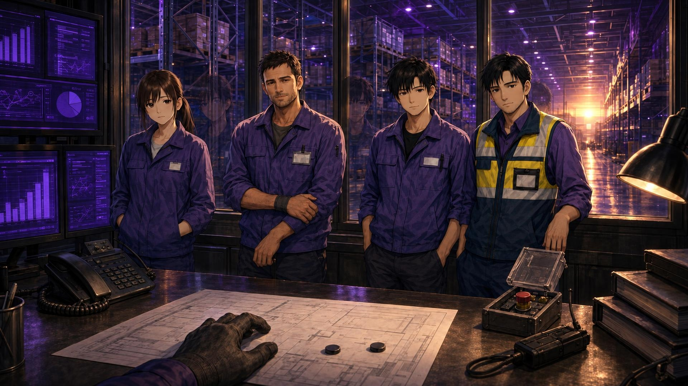

# 🎮 Purple Shift — визуальная новелла


**Purple Shift** — это оригинальная визуальная новелла с аниме-эстетикой и сюжетом, вдохновлённым жизненным опытом и атмосферой склада.

Проект создан на движке **Ren’Py (Python)** и представляет собой интерактивную историю с развитыми персонажами, диалогами и визуальными элементами.

---

## 🧠 Описание

Purple Shift сочетает в себе:

- 📘 сюжет с интригой и развилками
- 🧍‍♀️ много персонажей
- 🎨 собственные спрайты, фоны и экранные элементы
- 🗺️ ветвления на основе решений игрока
- 💜 атмосферу Purple-стиля
- 📊 четыре направления характера: человечность, выносливость, эффективность и юмор
- 🤝 отдельные маршруты Леры, Виктора, Макса и Артёма

---

## 💜 Версия 2.1 — «Живая смена»

Версия 2.1 делает маршруты четырёх героев частью самой аварии, а не отдельной сценой перед общим финалом.

- разговор шестого дня получает самостоятельный выбор для Леры, Виктора, Макса или Артёма;
- в седьмой день ведущий маршрут меняет действия команды во время аварии;
- добавлены восемь личных исходов: путь роста и путь тени для каждого героя;
- четыре новых эмоциональных спрайта поддерживают ключевые состояния персонажей;
- короткие соседние реплики объединены, а опорные сцены переписаны более естественным языком;
- интерфейс больше не показывает номер старого ремастера;
- сохранения версий 1.x и 2.0 автоматически получают поля схемы 2.1;
- GitHub Actions собирает готовый Windows/Linux-архив при публикации тега `v*`.



---

## 💜 Версия 2.0 - «По ту сторону смены»

Версия 2.0 превращает завершённую неделю из последовательности рабочих эпизодов в единую историю с тремя сторонами каждого дня: до смены, внутри потока и после проходной.

- состояние героя теперь учитывает усталость, давление и решимость;
- у всей команды есть доверие, страх, раскол и взаимовыручка;
- новые решения не имеют очевидно правильного ответа и возвращаются через несколько дней;
- у каждого из четырёх маршрутов появилась дополнительная кризисная развилка;
- Фиолетовый Шторм реагирует на состояние людей и память прохождения;
- телефон получил личный дневник и карту решений;
- финальный день собирает последствия всей недели перед последним выбором;
- семь основных концовок получили подробные динамические эпилоги;
- после первого прохождения открывается режим «Новая смена+» с дополнительными повторами и намёками;
- коллекция пополнилась четырьмя новыми эпилоговыми CG.

---

## 📖 Полная история

Сюжет охватывает одну рабочую неделю: **семь игровых дней — семь глав — семь возможных финалов**.

- **Глава 1 — «День первый: Первая смена»**: знакомство со складом, первая ошибка, давление нормы и возвращение домой.
- **Глава 2 — «День второй: Вторая смена»**: сортировка, новый уровень ответственности и опасный переполненный контейнер.
- **Глава 3 — «День третий: Чужие цифры»**: рейтинг «Сотрудник месяца» и исчезнувшая запись об инциденте.
- **Глава 4 — «День четвёртый: Чужая ошибка»**: системная недостача, которую пытаются списать на Леру.
- **Глава 5 — «День пятый: Предел нагрузки»**: неисправный подъёмник и выбор между безопасностью и планом.
- **Глава 6 — «День шестой: Цена подписи»**: приезд Куратора, предложение должности и отчёт, способный скрыть нарушения.
- **Глава 7 — «День седьмой: Последняя смена»**: пиковая нагрузка, отказ системы и итоговый выбор героя.

Финал определяется не одной последней кнопкой. Игра учитывает решения всей недели, отношения, собранные доказательства, командное доверие и сформировавшийся характер героя.

---

## 📌 Основные возможности

✔ интерактивные диалоги  
✔ выборы с накопительными последствиями
✔ три фазы каждого дня: до смены, внутри потока и после проходной
✔ усталость, давление и решимость героя
✔ доверие, страх, раскол и взаимовыручка всей команды
✔ личный дневник и карта решений в телефоне
✔ режим «Новая смена+» после первого финала
✔ уникальные персонажи  
✔ кастомные экраны и интерфейсы  
✔ экран итогов каждой смены
✔ интерактивный экран ТСД
✔ разные реплики и сцены на основе прошлых решений
✔ семь полноценных финалов — от командной победы до тёмной концовки «Сотрудник месяца»
✔ телефон героя со статистикой, отношениями и прогрессом недели
✔ полноценные переписки с последствиями для отношений и финалов
✔ групповой чат смены, голосовое сообщение, вложения и возможность отложить ответ
✔ карточки Леры, Виктора, Макса и Артёма с биографиями и памятью отношений
✔ исследуемая карта склада с пятью зонами и ограниченным числом действий
✔ 25 дополнительных событий, которые невозможно увидеть за одно прохождение
✔ четыре интерактивных осмотра локаций с двенадцатью точками интереса
✔ четыре накапливаемых маршрута и 20 дополнительных личных сцен на протяжении недели
✔ восемь внутренних состояний маршрутов: по пути роста и тени для Леры, Виктора, Макса и Артёма
✔ восемь самостоятельных личных развязок, встроенных в финальную аварию
✔ четыре конфликта между членами команды, в которых герои спорят и меняются не только рядом с игроком
✔ возвращение конкретных решений в более поздних днях, диалогах, телефонных сообщениях и финале
✔ дополнительные личные разговоры, маршрутные переписки и четыре послесловия
✔ три большие командные сцены, где люди существуют вне производственной задачи
✔ три бытовых события с последствиями: вода, перчатки и человеческий табель
✔ общая память недели, которая сохраняет не только решения, но и маленькие человеческие моменты
✔ три новых групповых сообщения смены с живыми ответами
✔ экран «Смена помнит» с последствиями прошлых решений
✔ отдельная панель «Смена» на клавише Q: команда, честность, улики, выгорание, маршрут и память
✔ архив документов, CG, музыки и маршрутов с процентом прохождения
✔ исправленное переключение разделов Архива
✔ отдельная вкладка дела V-13 с восемью следами и восстановленным каналом
✔ выбор уже открытой главы со сбалансированным состоянием истории
✔ день и текущий маршрут в метаданных сохранения
✔ постоянная коллекция достижений и открытых финалов
✔ интерактивная сортировка товаров на ТСД
✔ интерактивная «живая линия» с выбором между безопасностью, результатом и людьми
✔ полноценная расстановка смены: ротация, работа по опыту или рискованный рывок
✔ расследование происшествия со сбором проверяемых доказательств
✔ углублённая доска расследования: хронология из четырёх событий, ложные следы и выбор общей причины
✔ ручная передача аварийных команд в седьмой главе
✔ отдельные сцены перерыва с Лерой, Виктором и Максом
✔ личная сцена с самым близким герою персонажем
✔ новые складские локации, эмоциональные спрайты и сюжетные CG
✔ 26 сюжетных, маршрутных, эпилоговых и секретных CG
✔ исправленный CG аварийной кнопки: герои стоят на безопасной площадке, а не на линии
✔ пять новых CG о знакомстве, планировании смены и вторжениях V-13
✔ шесть CG версии 1.7: командный спор, расследование, поддельный голос, развилка маршрута, рассвет и Нулевая смена
✔ три CG версий 1.8–1.9: общий перерыв, стена памяти недели и последняя развилка за проходной
✔ скрытая цепочка из восьми следов и декодирование канала Фиолетового Шторма
✔ три вторжения Шторма в дни 5–7: лишний человек на камере, сообщение из завтра и имена на отключённом табло
✔ головоломка V-13, в которой поддельный голос определяется по памяти об изменившихся персонажах
✔ истинный посткредитный эпизод «Нулевая смена» для безошибочного глубокого прохождения
✔ живое движение персонажей с учётом настройки уменьшения движения
✔ кинематографические рамки, медленные наезды камеры и цветовые переходы
✔ динамическое главное меню, меняющее фон после прохождения и открытия скрытой линии
✔ многослойная звуковая среда девяти режимов окружения
✔ 17 оригинальных звуков, четыре базовых мотива и восемь развивающихся музыкальных вариантов маршрутов
✔ переработанное повествование: меньше однословных кликов, естественнее диалоги и единый рассказ от второго лица
✔ режим помощи в мини-играх, уменьшение движения и вспышек
✔ пояснения к новым выборам без показа точных очков
✔ высокий контраст и тихий режим нового интерфейса
✔ игровая логика на Python  
✔ завершённая сюжетная арка на 7 дней

Телефон открывается кнопкой **«Телефон»** в нижнем меню или клавишей **P**. Панель текущей смены открывается кнопкой **«Смена»** или клавишей **Q**. Личный дневник и карта решений находятся на вкладке состояния телефона. На мобильных устройствах используются кнопки интерфейса. Дополнительные параметры постановки и доступности находятся в стандартном меню настроек.

---

## 🛠 Технологии

Этот проект использует:

- **Ren’Py** (движок для визуальных новелл, основанный на Python)
- **Python** (логика и скрипты)
- ATL-анимации
- Собственные изображения и ресурсы

---

## 📂 Структура проекта

```text
purple-shift/
├── game/
│   ├── core/save_migrations.rpy # совместимость сохранений
│   ├── routes/living_routes.rpy # сцены и восемь исходов маршрутов 2.1
│   ├── script.rpy                # первый день
│   ├── chapter3.rpy              # второй день
│   ├── week.rpy                  # дни 3–7 и основные финалы
│   ├── beyond_shift.rpy          # три фазы дня и «Новая смена+»
│   ├── characters.rpy            # персонажи, изображения и трансформации
│   ├── systems.rpy               # характеристики и игровые экраны
│   ├── images/
│   └── audio/
├── .github/workflows/            # проверки и выпуск дистрибутивов
├── tools/             # воспроизводимый генератор оригинального звукового пакета
├── ARCHITECTURE.md
├── ASSET_CREDITS.md
├── README.md
├── CHANGELOG.md
└── LICENSE
```

Подробнее о границах модулей и состоянии игры — в [ARCHITECTURE.md](ARCHITECTURE.md).

---

## 📦 Скачать готовую сборку

Готовые Windows/Linux-архивы публикуются в разделе [GitHub Releases](https://github.com/Bekk3r1337/purple-shift/releases). Если релиза ещё нет, игру можно запустить из исходников через Ren’Py SDK по инструкции ниже.

---

## 🚀 Как запустить игру

1. Скачай **Ren’Py SDK** с официального сайта:  
https://www.renpy.org/latest.html

2. Открой Ren’Py и добавь папку `purple-shift` как проект.

3. Запусти проект через Ren’Py Launcher.

---

## 🧪 Проверка проекта

Проект содержит автоматические тесты Ren’Py 8.5+:

```bash
./renpy.sh /path/to/purple-shift lint --error-code
./renpy.sh /path/to/purple-shift test purple_shift --report-detailed
```

GitHub Actions автоматически запускает lint и тесты для новых изменений и pull request.

Текущая сборка проверена на Ren’Py 8.5.3: **59 тестов и 308 утверждений**.

---

## 📜 Лицензия

Код проекта распространяется под **MIT License**. Происхождение и статус ресурсов перечислены отдельно в [ASSET_CREDITS.md](ASSET_CREDITS.md).

---

## 👤 Автор

**Bekker (Bekk3r1337)**  
Telegram: @MrZerrix  
GitHub: https://github.com/Bekk3r1337
